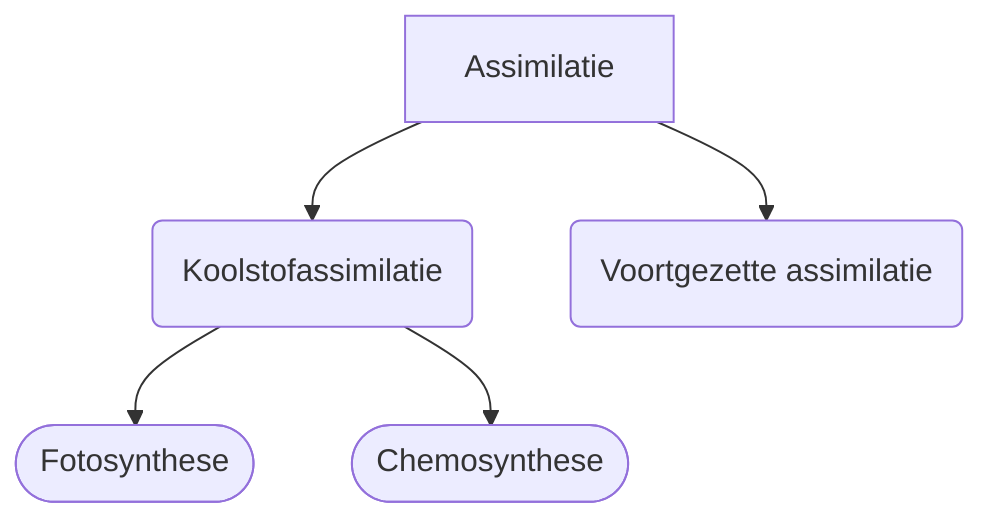

---
tags:
  - biol
  - lesnotitie
---
## Licht- en donkerreacties
Organellen die een belangrijke rol spelen bij de stofwisseling:
- Mitochondriën
	- Dissimilatie: $\ce{O2} + \text{glucose} \to \ce{H2O} + \ce{CO2}$
	- Omzetten naar APT: $\text{ADP} \to \text{ATP}$
- Chloroplasten/bladgroenkorrels
	- Assimilatie: $\ce{CO2}+\ce{H2O} \to \ce{O2} + \text{glucose}$;
	- Krijgt energie uit licht
	- Fotosynthese
### Fotosynthese: calvincyclus & lichtreactie
[[BiNaS#69B Lichtreactie]]

